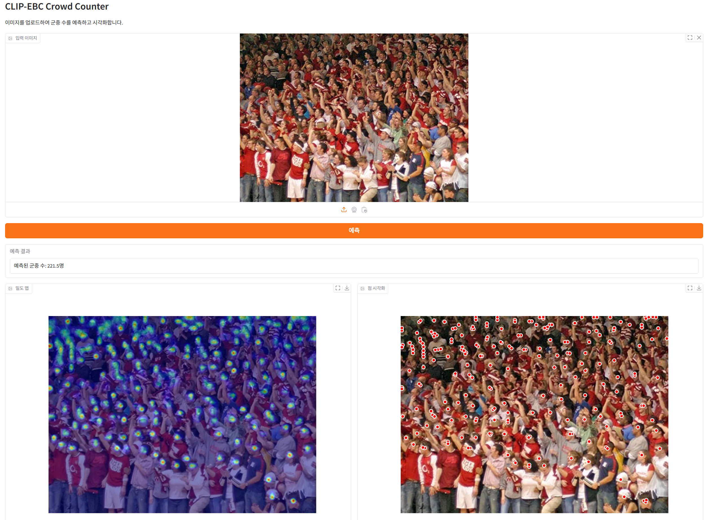

# CLIP-EBC: Crowd Counting with CLIP (ONNX 버전)

이 저장소는 [Original Repo](https://github.com/Yiming-M/CLIP-EBC)의 모델 추론 레이어 코드를 기반으로 하고 있습니다.  
원본 레포지토리의 저작권은 원저자(Yiming-M)에게 있으며, 해당 코드는 MIT 라이선스로 배포되었습니다.  

---

CLIP-EBC 추론 파트를 가져와 ONNX로 변환했습니다.
이미지 내의 군중 수를 계산하고 시각화해주는 레포입니다.

## ONNX 변환 주요 개선 사항

- **속도 향상**: ONNX Runtime을 사용하여 더 빠른 추론 속도 제공
- **메모리 효율성**: 모델 크기 감소 및 메모리 사용량 최적화
- **배포 용이성**: PyTorch 의존성 없이 ONNX Runtime만으로 실행 가능
- **크로스 플랫폼 지원**: 다양한 하드웨어 및 소프트웨어 환경에서 실행 가능

## 설치 방법

```bash
conda create -n ebc python=3.12.4
conda activate ebc
pip install -r requirements.txt
```

## Tensorrt Convert
```bash
pip install nvidia-tensorrt pycuda
```


## Gradio
```bash
python app.py
```


## 주요 기능

- 이미지 내 군중 수 예측
- 밀도 맵 시각화
- 점 형태의 군중 위치 시각화
- 이미지 파일 또는 넘파이 배열 입력 지원
- 시각화 결과 저장 기능
- ONNX 모델 지원으로 더 빠른 추론 속도

## 매개변수 설정

```python
model = ClipEBCOnnx(
    onnx_model_path="clip_ebc_model.onnx",  # ONNX 모델 경로
    truncation=4,          # 잘라내기 매개변수
    reduction=8,           # 축소 비율
    granularity="fine",    # 세분화 수준
    # 기타 매개변수...
)
```

## 사용 방법

### Python 코드에서 사용
```python
from custom.clip_ebc_onnx import ClipEBCOnnx

model = ClipEBCOnnx(onnx_model_path="clip_ebc_model.onnx")

# 이미지에서 군중 수 예측
count = model.predict("path/to/image.jpg")
print(f"예측된 군중 수: {count}")

# 밀도 맵 시각화
fig, density_map = model.visualize_density_map(
    alpha=0.5,  # 투명도 설정
    save=True,  # 이미지 저장
    save_path="density_map.png"  # 저장 경로 지정 (선택사항)
)

# 점 형태로 시각화
fig, dot_map = model.visualize_dots(
    dot_size=20,  # 점 크기
    sigma=1,      # Gaussian 필터 설정
    percentile=97, # 임계값 백분위수
    save=True,    # 이미지 저장
    save_path="dot_map.png"  # 저장 경로 지정 (선택사항)
)
```

### 명령줄 인터페이스(CLI) 사용

main.py를 사용하여 명령줄에서 CLIP-EBC ONNX를 실행할 수 있습니다.

#### 기본 사용법

```bash
python main.py --image path/to/image.jpg --model clip_ebc_model.onnx
```

#### 시각화 옵션

시각화 타입을 선택할 수 있습니다:
```bash
# 밀도 맵만 시각화
python main.py --image path/to/image.jpg --model clip_ebc_model.onnx --visualize density

# 점 형태로만 시각화
python main.py --image path/to/image.jpg --model clip_ebc_model.onnx --visualize dots

# 모든 시각화 수행
python main.py --image path/to/image.jpg --model clip_ebc_model.onnx --visualize all
```

#### 시각화 매개변수 설정

```bash
# 밀도 맵 투명도 설정
python main.py --image path/to/image.jpg --model clip_ebc_model.onnx --visualize density --alpha 0.7

# 점 시각화 설정
python main.py --image path/to/image.jpg --model clip_ebc_model.onnx --visualize dots --dot-size 30 --sigma 1.5 --percentile 95
```

#### 결과 저장

```bash
# 기본 디렉토리에 저장
python main.py --image path/to/image.jpg --model clip_ebc_model.onnx --visualize all --save

# 사용자 지정 디렉토리에 저장
python main.py --image path/to/image.jpg --model clip_ebc_model.onnx --visualize all --save --output-dir my_results
```

#### CLI 매개변수 설명

| 매개변수 | 설명 | 기본값 |
|----------|------|---------|
| `--image` | 입력 이미지 경로 (필수) | - |
| `--model` | ONNX 모델 파일 경로 | 'clip_ebc_model.onnx' |
| `--visualize` | 시각화 타입 ('density', 'dots', 'all', 'none') | 'none' |
| `--save` | 결과 저장 여부 | False |
| `--output-dir` | 결과 저장 디렉토리 | 'results' |
| `--alpha` | 밀도 맵 투명도 (0~1) | 0.5 |
| `--dot-size` | 점 크기 | 20 |
| `--sigma` | Gaussian 필터 시그마 값 | 1.0 |
| `--percentile` | 점 시각화 임계값 백분위수 (0~100) | 97 |

## PyTorch에서 ONNX로 변환

원본 PyTorch 모델을 ONNX로 변환하려면 다음 스크립트를 사용할 수 있습니다:
```bash
# 기본 변환 , 모델 존재해야함
python main_onnx_convert.py

# 결과값 테스트
python main_onnx_abs_test.py
```
